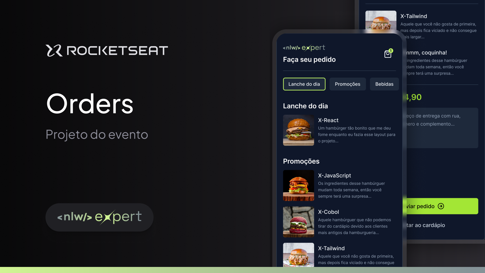

Aplicação desenvolvida na trilha React Native da Next Level Week da [RockeatSeat](https://rocketseat.com.br/?utm_source=aluno&utm_medium=germano-ricardi&utm_campaign=dev_fullstack).

Veja a aplicação em produção:
Em breve.

## Descrição  

Aplicação para delivery, recursos disponíveis:
*   Cardápio organizado por categorias
*   Página detalhada do lanche
*   Visualização do pedido no carrinho

Apesar de serem poucas as funcionalidades, foram aplicados conceitos como:
*   Componentes
*   Tailwindcss
*   Preview com expo

## Tecnologias utilizadas

* [x] [NodeJS](https://nodejs.org/en)
* [x] [React Native](https://reactnative.dev)
* [x] [TypeScript](https://www.typescriptlang.org)

## Quickstart
Clone o repositório:
```sh
$  git clone https://github.com/germanoricardi/nlw-expert-rn-orders.git
```

Para executar a aplicação utilize os seguintes comandos na raiz da aplicação:
```sh
$  npx expo start
```

Para visualizar em seu dispositivo, é necessário instalar o Expo Go disponível para Android e iOs e escanear o QR Code que é exibido no terminal.